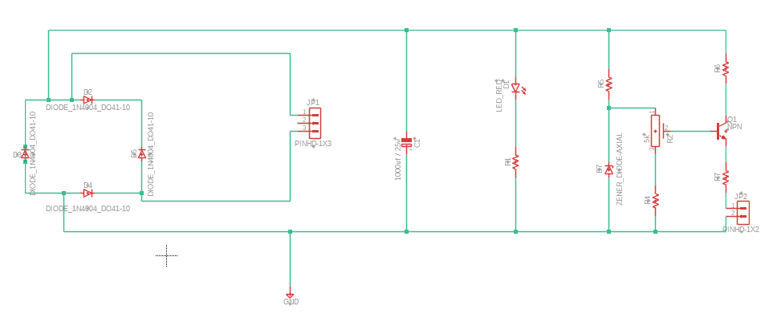
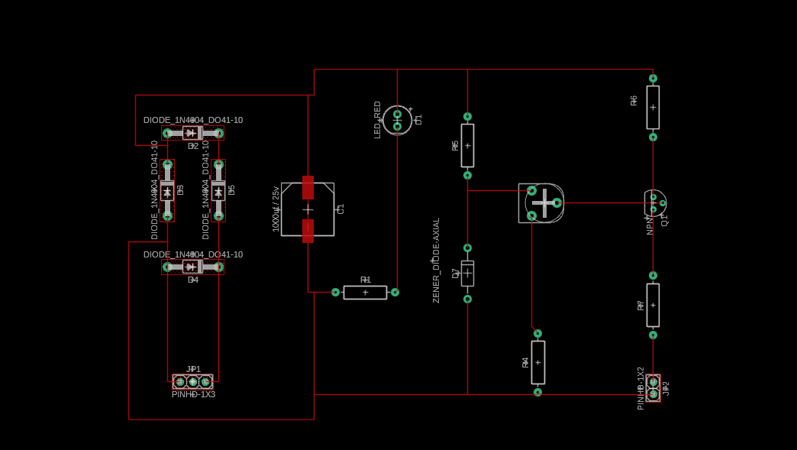
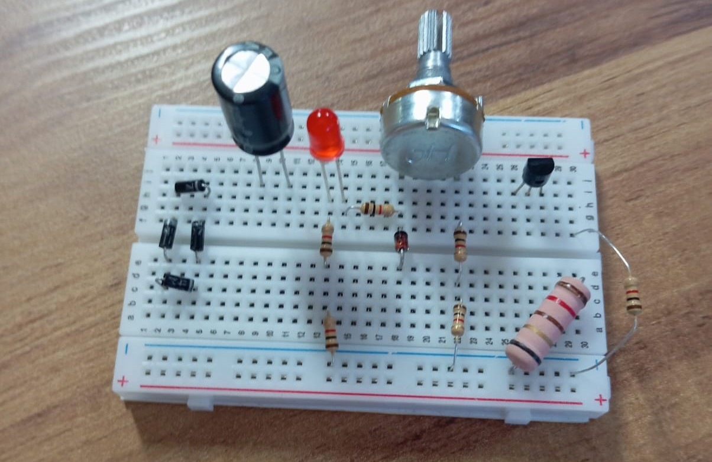

# Fonte de Tensão Ajustável

## Descrição

Fonte de tensão ajustável projetada para a disciplina SSC0180 – Eletrônica para Computação no ICMC-USP, do docente Eduardo do Valle Simões. Nele, busca-se projetar uma fonte de tensão ajustável entre 3v e 12v, com uma corrente de 100mA(máx.). Segue-se a tabela dos materiais utilizados e seus respectivos custos, os cálculos que justificam a arquitetura da fonte, a simulação realizada no Falstad e as esquemáticas do projeto no Tinkercad e no Eagle.

## Componentes
---
| Quantidades   | Componentes   | Preço |
| ------------- |:-------------:| -----:|
| 1      | Capacitor (1000uF x 25V)      | R$2,00  |
| 1      | LED 5mm vermelho              | R$0,50  |
| 4      | Diodos (Ponte)                | R$0,60  |
| 1      | Potenciômetro 5K - linear     | R$7,00  |
| 1      | Transistor 2N3904 NPN         | R$1,60  |
| 1      | Diodo Zener 1N4743 (13V / 1W) | R$0,50  |
| 10     | Resistor 1K - (1/4W)          | R$0,70  |
| 10     | Resistor 100 - (1/4W)         | R$0,70  |
| 10     | Resistor 120 - 5W             | R$1,40  |
| 1      | Protoboard - 400 furos        | R$23,80 |
| 10     | Kit Jumper - Macho-Macho      | R$7,00  |
| 50     | Total                         | R$45,80 |

### Transformador

O transformador atua na redução da amplitude da tensão proveniente da rede elétrica, atenuando-a de 180V para 18,1V. Esse processo de conversão fundamenta-se na variação do fluxo magnético através das espiras do componente, o que gera o fenômeno da indução eletromagnética.

### Ponte de Diodo

A ponte de diodos tem por função assegurar a unidirecionalidade do fluxo de corrente elétrica ao longo do circuito. Essa retificação faz-se necessária visto que a tensão de entrada possui caráter senoidal, apresentando alternâncias negativas. Dessa forma, o arranjo composto por quatro diodos impede a inversão da corrente, retificando a onda.

### Capacitor

O capacitor desempenha o papel de manter o fornecimento de tensão ao circuito durante os intervalos em que a onda senoidal apresenta taxa de variação negativa (períodos de descarga). Desse modo, o componente armazena energia em seu campo elétrico nos momentos de pico de tensão e a restitui ao sistema quando a tensão externa decai abaixo do potencial acumulado.

### Resistor

O resistor destina-se à limitação da intensidade da corrente elétrica direcionada a um determinado componente. Essa atenuação visa preservar os limites nominais de potência do dispositivo em questão, garantindo sua integridade operacional e prevenindo sobrecargas.

### LED

O diodo emissor de luz (LED) atua como um sinalizador visual do comportamento dinâmico do circuito. O objetivo de sua aplicação é que permaneça constantemente energizado, atestando de forma empírica que a corrente elétrica foi retificada com sucesso e encontra-se em regime contínuo (ou aproximadamente estável).

### Diodo Zenner

O diodo Zener é empregado com a finalidade de regular e limitar a tensão máxima do sistema. Na presente configuração, o componente estabiliza o potencial em 13V que, após a respectiva queda de tensão na junção do transistor, estabelece-se em 12,3V.

### Transistor

O transistor é responsável pela amplificação do sinal elétrico de entrada, atuando de forma a prover uma capacidade de corrente de 100 mA na seção de saída do circuito.

### Potenciômetro

O potenciômetro viabiliza o ajuste e o controle analógico da tensão de saída do circuito, permitindo a variação contínua da faixa operacional entre os limites de 3V e 12V.

---
## Circuitos:

### Falstad
https://shorturl.at/jkgNi


### Tinkercad


### Eagle








### Real Life



### Vídeo de Explicação

https://youtu.be/debH5PX0NH0
---

## Cálculos:

### Transformador
```
Vprimário V1 = 127V (RMS)            | V1 Pico = 127 * √2 ~ 180V
Vsecundário V2 = 127/7 ~ 18,1 (RMS)  | V2 Pico = 18,1 * √2 ~ 25,6V
                        |_ Razão de espiras (1 : 7)
````

### Correntes
````
Icarga (Resistor 120Ω) = Vmax / Rcarga = 12,2/120 ~ 101mA
Ipotenciômetro |Vponte + Vresisitor| / Rpotenciômetro + R(em baixo pot) = 9 + 4 / 5000 + 2.200 = 13/7200 ~ 1,9mA
Izenner = |Vzenner + Vresisitor| / R(em cima zenner) = |(-13) + (9)| / 1000 = 4mA
Iled = |Vled + Vresisitor| / R (em baixo led) = 2 + 20 / 2000 = 22/2000 == 11mA
Itotal = Icarga + Ipot + Izenner + Iled = 101 + 1,9 + 4 + 11 ~ 118mA
````

### Capacitor
````
Vcapacitor = V2 Pico - (2 * 0,7) = 25,6 - 1,4 = 24,2V
Ripple desejado: < 10% => 24,2 * 0,1 = 2,42V
Frequênica: 120Hz (60Hz  * 2)
Capacitãncia (C) = Itotal / f * ripple = 0,118 / 120 * 2,42 ~ 406µ
````
---
---

# Jogo da Velha

## Introdução

Para este projeto, utilizaremos a plataforma de prototipagem Arduino Uno para desenvolver o famigerado jogo da velha, porém com o diferncial de ser contra uma "Inteligência Artificial".

## Componentes

| Componentes   |
| ------------- |
| Arduino Uno                |
| Teclado Matricial 4x4      |
| Display OLED SSD1306 (I2C) |
| Buzzer                     |

## Código da "IA"
```// ============================================================================
// FUNÇÕES AUXILIARES DE SUPORTE
// ============================================================================

// Avalia o tabuleiro atual para ver se alguém ganhou
int evaluateBoard(const char b[9]) {
  for (int i=0; i<8; i++) {
    int a=WINS[i][0], bb=WINS[i][1], c=WINS[i][2];
    if (b[a] != ' ' && b[a] == b[bb] && b[bb] == b[c]) {
      if (b[a] == 'O') return +10; // Vitória da IA
      if (b[a] == 'X') return -10; // Vitória do Humano
    }
  }
  return 0; // Ninguém ganhou ainda
}

// Verifica se ainda existem espaços vazios no tabuleiro
bool movesLeft(const char b[9]) {
  for (int i=0; i<9; i++) if (b[i] == ' ') return true;
  return false;
}


// ============================================================================
// IA FORTE: ALGORITMO MINIMAX (IMBATÍVEL)
// ============================================================================

// Função recursiva que simula o futuro do jogo para tomar a melhor decisão
int minimax(char b[9], bool isMax, int depth, int alpha, int beta) {
  int score = evaluateBoard(b);
  
  // Se a IA ('O') ganhou, prefere vencer o mais rápido possível (score - depth)
  if (score == 10) return score - depth;
  
  // Se o Humano ('X') ganhou, tenta adiar a derrota ao máximo (score + depth)
  if (score == -10) return score + depth;
  
  // Se não há mais jogadas, é um empate
  if (!movesLeft(b)) return 0;

  // Turno do Maximizador: A IA simulando suas próprias jogadas
  if (isMax) { 
    int best = -1000;

    for (int i = 0; i < 9; i++) {
      if (b[i] == ' ') {
        b[i] = 'O'; // Faz jogada hipotética
        
        int val = minimax(b, false, depth + 1, alpha, beta);
        
        b[i] = ' '; // Desfaz a jogada
        
        best = max(best, val);
        alpha = max(alpha, best);
        
        if (beta <= alpha) break; // Poda Alpha-Beta (cancela caminhos ruins)
      }
    }
    return best;
    
  // Turno do Minimizador: A IA simulando as respostas do Humano
  } else { 
    int best = 1000;

    for (int i = 0; i < 9; i++) {
      if (b[i] == ' ') {
        b[i] = 'X'; // Humano faz jogada hipotética
        
        int val = minimax(b, true, depth + 1, alpha, beta);
        
        b[i] = ' '; // Desfaz a jogada
        
        best = min(best, val);
        beta = min(beta, best);
        
        if (beta <= alpha) break; // Poda Alpha-Beta
      }
    }
    return best;
  }
}

// Disparador da IA Forte: testa as casas reais e escolhe a melhor segundo o Minimax
int bestMoveMinimax() {
  int bestVal = -1000;
  int bestMove = -1;

  for (int i = 0; i < 9; i++) {
    if (board[i] == ' ') {
      board[i] = 'O'; // Testa a jogada
      
      int moveVal = minimax(board, false, 0, -1000, 1000); // Calcula o futuro
      
      board[i] = ' '; // Limpa o teste
      
      if (moveVal > bestVal) {
        bestVal = moveVal;
        bestMove = i;
      }
    }
  }
  return bestMove;
}


// ============================================================================
// IA MÉDIA: BASEADA EM REGRAS DE PRIORIDADE (HEURÍSTICA)
// ============================================================================

int aiMoveMedium() {
  // REGRA 1: Se a IA puder ganhar nesta jogada, ela ganha!
  for (int i=0; i<9; i++) if (board[i]==' ') {
    board[i] = 'O';
    for (int w=0; w<8; w++) {
      int a=WINS[w][0], b=WINS[w][1], c=WINS[w][2];
      if (board[a] != ' ' && board[a]==board[b] && board[b]==board[c]) {
        board[i] = ' ';
        return i;
      }
    }
    board[i] = ' ';
  }
  
  // REGRA 2: Se o humano for ganhar na próxima, a IA bloqueia!
  for (int i=0; i<9; i++) if (board[i]==' ') {
    board[i] = 'X';
    for (int w=0; w<8; w++) {
      int a=WINS[w][0], b=WINS[w][1], c=WINS[w][2];
      if (board[a] != ' ' && board[a]==board[b] && board[b]==board[c]) {
        board[i] = ' ';
        return i;
      }
    }
    board[i] = ' ';
  }
  
  // REGRA 3: Se o centro estiver livre, domina o centro
  if (board[4] == ' ') return 4;
  
  // REGRA 4: Se o humano pegou um canto, joga no canto oposto para travar
  int corners[4] = {0, 2, 6, 8};
  for (int i=0; i<4; i++) {
    int c = corners[i];
    int opp = 8 - c;
    if (board[c]=='X' && board[opp]==' ') return opp;
  }
  
  // REGRA 5: Se sobrou algum outro canto livre, joga nele
  for (int i=0; i<4; i++) if (board[corners[i]]==' ') return corners[i];
  
  // REGRA 6: Joga nas laterais (meios)
  int sides[4] = {1, 3, 5, 7};
  for (int i=0; i<4; i++) if (board[sides[i]]==' ') return sides[i];
  
  // SISTEMA DE EMERGÊNCIA: Joga na primeira vaga que encontrar
  for (int i=0; i<9; i++) if (board[i]==' ') return i;
  return -1;
}


// ============================================================================
// IA FRACA: PURAMENTE ALEATÓRIA (SORTE)
// ============================================================================

int aiMoveWeak() {
  int empties[9], n=0;
  
  // Lista todas as posições vazias disponíveis
  for (int i=0; i<9; i++) if (board[i]==' ') empties[n++]=i;
  
  // Se não houver vagas, para o jogo
  if (n==0) return -1;
  
  // Escolhe e retorna uma das vagas de forma totalmente aleatória
  return empties[random(0, n)];
}


// ============================================================================
// GERENCIADOR DE TURNOS DA IA
// ============================================================================

// Função que o jogo chama. Ela decide qual inteligência usar com base no nível escolhido
int aiMove() {
  if (aiLevel == 1) return aiMoveWeak();   // Aciona nível fácil
  if (aiLevel == 2) return aiMoveMedium(); // Aciona nível médio
  return bestMoveMinimax();                // Aciona nível difícil/forte
}
```
---
## Participantes:
---
#### Arthur Nunes de Castro Zille - 17870441

#### Felipe Quierelli de Souza - 17831346

#### Giovanni Pansera Tondello - 17893040

